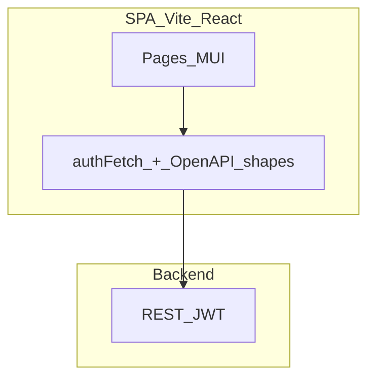

# 📚 Book stuff

> 🎯 **Organiser des lieux, partager l’accès, éviter les doublons.**

[](https://nodejs.org/)
[](https://pnpm.io/)
[](https://www.typescriptlang.org/)
[](https://react.dev/)
[](https://vitejs.dev/)
[](https://vitest.dev/)
[](https://mui.com/)
[](LICENSE)

[](https://github.com/ripoul/book-stuff)
[](https://github.com/ripoul?tab=repositories)

---

## 💡 À propos

**Book stuff** est une appli **React** branchée sur une **API REST** (🔐 JWT, comptes, réservation / lieux) :

- 📍 **Places** — visibilité, droits
- 📎 **Ressources** — liées à chaque lieu
- ✉️ **Invitations** — invité ↔ gestionnaire

En dev, le proxy Vite envoie souvent `/api` vers un serveur local type **Django** (`127.0.0.1:8000`) → voir `vite.config.ts` et `VITE_API_BASE_URL`.

---

## 🔗 Dépôts

| Rôle            | Lien                                                                                                                           |
| --------------- | ------------------------------------------------------------------------------------------------------------------------------ |
| 🖥️ **Frontend** | [**github.com/ripoul/book-stuff**](https://github.com/ripoul/book-stuff) _(ce dépôt)_                                          |
| 🔌 **Backend**  | [**Dépôts @ripoul**](https://github.com/ripoul?tab=repositories) _(trouver l’API / OpenAPI : `/booking/`, `/accounts/`, etc.)_ |

💬 _Si l’API est ailleurs, mets à jour la ligne « Backend » avec l’URL exacte du dépôt._

---

## ✨ Fonctionnalités

### 👤 Côté utilisateur

| Zone           | Détail                                                          |
| -------------- | --------------------------------------------------------------- |
| 👋 Compte      | Inscription, connexion, profil (nom, email)                     |
| 📍 Lieux       | Liste, détail, ressources paginées                              |
| ✉️ Invitations | Liste + filtre statut, accepter / refuser selon le cycle de vie |
| 🔔 UX          | Pastille sur l’avatar = nombre d’invitations **pending**        |

### 🔧 Côté gestionnaire de lieu

| Zone           | Détail                                                                                                        |
| -------------- | ------------------------------------------------------------------------------------------------------------- |
| 📍 Lieu        | Création / édition si `can_manage`                                                                            |
| 📎 Ressources  | CRUD sur la fiche lieu                                                                                        |
| ✉️ Invitations | Filtres (place, plusieurs statuts), inviter par email, révoquer, ré-inviter (`revoked` → `pending` via PATCH) |

---

## 🗺️ Schéma (vue d’ensemble)



---

## 🛠️ Développement

### 📋 Prérequis

| Outil          | Version                                          | Badge                                                                                                      |
| -------------- | ------------------------------------------------ | ---------------------------------------------------------------------------------------------------------- |
| **Node.js**    | `>= 26`                                          |                     |
| **pnpm**       | `9.x` (`packageManager` dans `package.json`)     |                               |
| **pre-commit** | Python 3 + [pre-commit](https://pre-commit.com/) |  |

### 📥 Installation

```bash
corepack enable
pnpm install
cp .env.example .env
```

| Variable            | Rôle                                                     |
| ------------------- | -------------------------------------------------------- |
| `VITE_API_BASE_URL` | Base de l’API (ex. `/api` derrière le proxy Vite en dev) |

### 📜 Scripts

| Commande                            | Effet                         |
| ----------------------------------- | ----------------------------- |
| `pnpm dev`                          | Vite + proxy `/api` → backend |
| `pnpm build`                        | `tsc -b` + bundle production  |
| `pnpm test`                         | Vitest (happy-dom)            |
| `pnpm lint`                         | ESLint, zéro warning          |
| `pnpm format` / `pnpm format:check` | Prettier                      |
| `pnpm check`                        | `lint` + `format:check`       |

### 🪝 Pre-commit (hooks Git)

Définition : [`.pre-commit-config.yaml`](.pre-commit-config.yaml)

- 🧹 `trailing-whitespace`, `end-of-file-fixer`, `check-yaml`, `check-json`, `check-added-large-files`
- ✨ **eslint** — `pnpm exec eslint --fix --max-warnings=0` (TS/TSX)
- 💅 **prettier** — `pnpm exec prettier --write`

**Une fois par clone :**

```bash
pip install pre-commit   # ou : brew install pre-commit
pre-commit install
```

**Tout le dépôt :**

```bash
pre-commit run --all-files
```

> ⚠️ Les hooks appellent `pnpm exec` → lance `pnpm install` avant la première exécution.

### 🧰 Chaîne d’outils

| Domaine | Outil                                     |
| ------- | ----------------------------------------- |
| Build   | Vite 5, `@vitejs/plugin-react`            |
| Langage | TypeScript ~6                             |
| UI      | MUI 9, Emotion                            |
| Tests   | Vitest 2, Testing Library, happy-dom      |
| Qualité | ESLint 9, Prettier 3, `typescript-eslint` |
| CI      | GitHub Actions → `.github/workflows/`     |

---

☕ _Fait avec des flèches, des tableaux et un peu de café._
